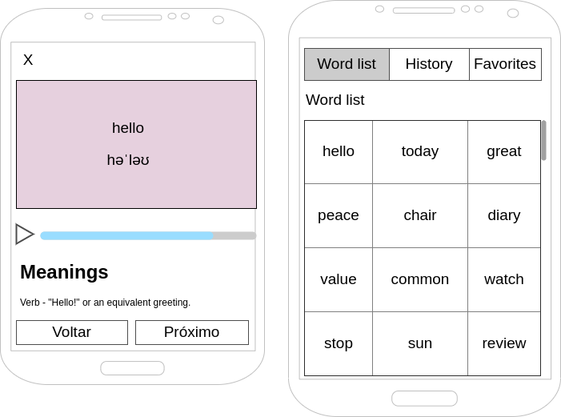

# Mobile Challenge 🏅 2022 - Dictionary

## Introdução

Este é um desafio para que possamos ver as suas habilidades como Mobile Developer.

Nesse desafio você deverá desenvolver um aplicativo para listar palavras em inglês, utilizando como base a API [Words API](https://www.wordsapi.com/). O projeto a ser desenvolvido por você tem como objetivo exibir termos em inglês e gerenciar as palavras visualizadas, conforme indicado nos casos de uso que estão logo abaixo.

[SPOILER] As instruções de entrega e apresentação do challenge estão no final deste Readme (=

### Antes de começar
 
- Prepare o projeto para ser disponibilizado no Github, copiando o conteúdo deste repositório para o seu (ou utilize o fork do projeto e aponte para o Github). Confirme que a visibilidade do projeto é pública (não esqueça de colocar no readme a referência a este challenge);
- O projeto deve utilizar a Linguagem específica na sua Vaga (caso esteja se candidatando). Por exempo: Python, R, Scala e entre outras;
- Considere como deadline 5 dias a partir do início do desafio. Caso tenha sido convidado a realizar o teste e não seja possível concluir dentro deste período, avise a pessoa que o convidou para receber instruções sobre o que fazer.
- Documentar todo o processo de investigação para o desenvolvimento da atividade (README.md no seu repositório); os resultados destas tarefas são tão importantes do que o seu processo de pensamento e decisões à medida que as completa, por isso tente documentar e apresentar os seus hipóteses e decisões na medida do possível.

### Instruções iniciais obrigatórias

- Utilize as seguintes tecnologias:

#### Tecnologias (Mobile):
- Nativo ou Hibrido (Flutter, Ionic, React Native, etc)
- Estilização (Material, Semantic, etc). Ou escrever o seu próprio sob medida 👌
- Gestão de dados (Redux, Context API, IndexedDB, SQLite, etc)

Atente-se, ao desenvolver a aplicação mobile, para conceitos de usabilidade e adeque a interface com elementos visuais para os usuários do seu sistema.

#### Tecnologias (Back-End):
- Firebase, Supabase, etc

#### Organização:
- Aplicação de padrões Clean Code
- Validação de chamadas assíncronas para evitar travamentos

### Modelo de Dados:

Conforme indicado na documentação da API, a estrutura de dados presente retorna as seguintes informações:

```json
{
  "word": "example",
  "results": [
    {
      "definition": "a representative form or pattern",
      "partOfSpeech": "noun",
      "synonyms": [
        "model"
      ],
      "typeOf": [
        "representation",
        "internal representation",
        "mental representation"
      ],
      "hasTypes": [
        "prefiguration",
        "archetype",
        "epitome",
        "guide",
        "holotype",
        "image",
        "loadstar",
        "lodestar",
        "microcosm",
        "original",
        "paradigm",
        "pilot",
        "prototype",
        "template",
        "templet",
        "type specimen"
      ],
      "derivation": [
        "exemplify"
      ],
      "examples": [
        "I profited from his example"
      ]
    },
    {
      "definition": "something to be imitated",
      "partOfSpeech": "noun",
      "synonyms": [
        "exemplar",
        "good example",
        "model"
      ],
      "typeOf": [
        "ideal"
      ],
      "hasTypes": [
        "pacemaker",
        "pattern",
        "beauty",
        "prodigy",
        "beaut",
        "pacesetter"
      ],
      "derivation": [
        "exemplify",
        "exemplary"
      ]
    },
    {
      "definition": "an occurrence of something",
      "partOfSpeech": "noun",
      "synonyms": [
        "case",
        "instance"
      ],
      "typeOf": [
        "happening",
        "natural event",
        "occurrence",
        "occurrent"
      ],
      "hasTypes": [
        "clip",
        "mortification",
        "piece",
        "time",
        "humiliation",
        "bit"
      ],
      "derivation": [
        "exemplify"
      ],
      "examples": [
        "but there is always the famous example of the Smiths"
      ]
    },
    {
      "definition": "an item of information that is typical of a class or group",
      "partOfSpeech": "noun",
      "synonyms": [
        "illustration",
        "instance",
        "representative"
      ],
      "typeOf": [
        "information"
      ],
      "hasTypes": [
        "excuse",
        "apology",
        "specimen",
        "case in point",
        "sample",
        "exception",
        "quintessence",
        "precedent"
      ],
      "derivation": [
        "exemplify",
        "exemplary"
      ],
      "examples": [
        "this patient provides a typical example of the syndrome",
        "there is an example on page 10"
      ]
    },
    {
      "definition": "punishment intended as a warning to others",
      "partOfSpeech": "noun",
      "synonyms": [
        "deterrent example",
        "lesson",
        "object lesson"
      ],
      "typeOf": [
        "monition",
        "admonition",
        "word of advice",
        "warning"
      ],
      "derivation": [
        "exemplary"
      ],
      "examples": [
        "they decided to make an example of him"
      ]
    },
    {
      "definition": "a task performed or problem solved in order to develop skill or understanding",
      "partOfSpeech": "noun",
      "synonyms": [
        "exercise"
      ],
      "typeOf": [
        "lesson"
      ],
      "examples": [
        "you must work the examples at the end of each chapter in the textbook"
      ]
    }
  ],
  "syllables": {
    "count": 3,
    "list": [
      "ex",
      "am",
      "ple"
    ]
  },
  "pronunciation": {
    "all": "ɪɡ'zæmpəl"
  },
  "frequency": 4.67
}
```

### Front-End:

Nessa etapa você deverá desenvolver uma aplicação móvel nativa ou hibrida para consumir a API do desafio.

**Obrigatório 1** - Você deverá atender aos seguintes casos de uso:

- Como usuário, devo ser capaz de visualizar uma lista de palavras com rolagem infinita
- Como usuário, devo ser capaz de visualizar uma palavra, significados e a fonética
- Como usuário, devo ser capaz de salvar a palavra como favorito
- Como usuário, devo ser capaz de remover a palavra como favorito
- Como usuário, devo ser capaz de visitar uma lista com as palavras que já vi anteriormente

A API não possui endpoint com a lista de palavras. Essa lista pode ser carregada em memória ou ser salva em banco de dados local ou remoto (por exemplo, com Firebase). Será necessário usar o [arquivo existente dentro do projeto no Github](https://github.com/dwyl/english-words/blob/master/words_dictionary.json).

**Obrigatório 2** - Salvar em cache o resultado das requisições ao Words API, para agilizar a resposta em caso de buscas com parâmetros repetidos.

**Obrigatório 3** - Seguir o wireframe para a página de listagem dos dados. Pode-se alterar a posição dos itens, mantendo as funcionalidades solicitadas.



**Diferencial 1** - Implementar um tocador de audio utilizando, por exemplo, https://responsivevoice.org/api ou recursos nativos;

**Diferencial 2** - Utilizar alguma ferramenta de Injeção de Dependência;

**Diferencial 3** - Escrever Unit Tests ou E2E Test. Escolher a melhor abordagem e biblioteca;

**Diferencial 4** - Implementar login com usuário e senha e associar os favoritos e histórico ao ID do usuário, salvando essa informação em banco de dados local ou remoto

## Readme do Repositório

- Deve conter o título do projeto
- Uma descrição sobre o projeto em frase
- Deve conter uma lista com linguagem, framework e/ou tecnologias usadas
- Como instalar e usar o projeto (instruções)
- Não esqueça o [.gitignore](https://www.toptal.com/developers/gitignore)
- Se está usando github pessoal, referencie que é um challenge by coodesh:  

>  This is a challenge by [Coodesh](https://coodesh.com/)


## Finalização e Instruções para a Apresentação

Avisar sobre a finalização e enviar para correção.

1. Confira se você respondeu o Scorecard anexado na Vaga que se candidatou;
2. Confira se você respondeu o Mapeamento anexado na Vaga que se candidatou;
3. Acesse [https://coodesh.com/challenges/review](https://coodesh.com/challenges/review);
4. Adicione o repositório com a sua solução;
5. Grave um vídeo, utilizando o botão na tela de solicitar revisão da Coodesh, com no máximo 5 minutos, com a apresentação do seu projeto. Utilize o tempo para:
- Explicar o objetivo do desafio
- Quais tecnologias foram utilizadas
- Mostrar a aplicação em funcionamento
- Foque em pontos obrigatórios e diferenciais quando for apresentar.
6. Adicione o link da apresentação do seu projeto no README.md.
7. Verifique se o Readme está bom e faça o commit final em seu repositório;
8. Confira a vaga desejada;
9. Envie e aguarde as instruções para seguir no processo. Sucesso e boa sorte. =)

## Suporte

Use a [nossa comunidade](https://discord.gg/rdXbEvjsWu) para tirar dúvidas sobre o processo ou envie uma mensagem diretamente a um especialista no chat da plataforma. 
